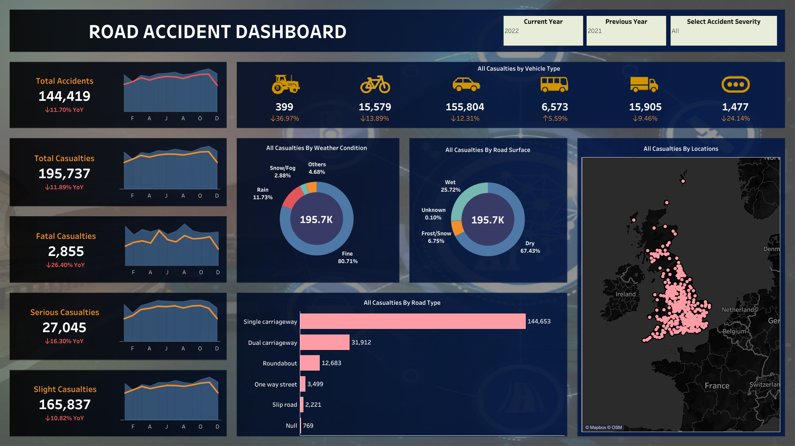

# Road Accident Dashboard



## Overview

This repository contains a Tableau dashboard that visualizes road accident data. The dashboard provides insights into various aspects of road accidents, helping to identify patterns and areas for improvement.

## Features

- **Interactive Visualizations**: Explore different dimensions of road accident data through interactive charts and graphs.
- **Data Filters**: Apply filters to view specific subsets of the data, such as accidents by location, time, or severity.
- **Summary Statistics**: Key statistics and metrics are highlighted to provide a quick overview of the data.

## Getting Started

1. **Clone the repository**:
   ```bash
   git clone https://github.com/RajKumar031998/Road-Accident-Dashboard.git
   ```
2. **Open the Tableau file**: Use Tableau Desktop to open the `Accident Project FINAL_v2021.3.twbx` file.
3. **Explore the Dashboard**: Interact with the visualizations and filters to gain insights from the data.

## Contributing

Feel free to fork this repository and submit pull requests. For major changes, please open an issue first to discuss what you would like to change.

## License

This project is licensed under the MIT License.

---

Does this look good to you?
